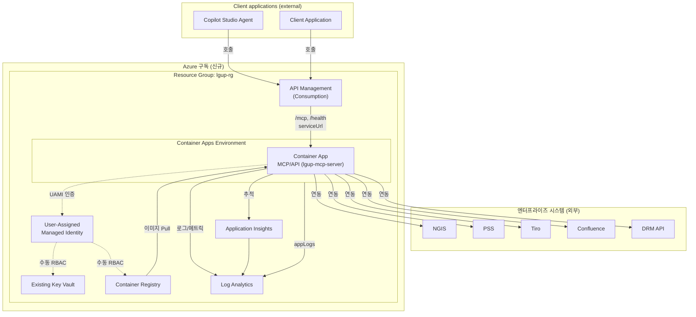
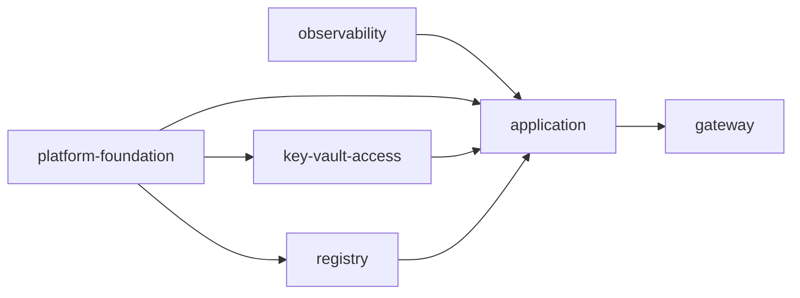

# Azure 인프라 배포 가이드 (신규 구독)

이 문서는 이 스택을 **새로운 Azure 구독**에 처음부터 배포하는 방법과,
배포되는 리소스들의 **관계도**를 설명합니다.

대상 템플릿: [main.bicep](../main.bicep) (subscription 스코프) + [modules/](../modules/) + 파라미터 [main.dev.bicepparam](../main.dev.bicepparam)

---

## 1. 무엇이 만들어지는가

`main.bicep`은 **구독 스코프(`targetScope = 'subscription'`)**에서 실행되며,
리소스 그룹 1개를 만들거나 재사용한 뒤 그 안에 아래 6개 모듈을 순서대로 배포합니다.

| 순서 | 모듈 | 생성 리소스 | 핵심 역할 |
|------|------|-------------|-----------|
| 1 | [observability.bicep](../modules/observability.bicep) | Log Analytics Workspace, Application Insights | 로그/메트릭/추적 수집 |
| 2 | [platform-foundation.bicep](../modules/platform-foundation.bicep) | User-Assigned Managed Identity | 워크로드 ID 기반 |
| 3 | [key-vault-access.bicep](../modules/key-vault-access.bicep) | 기존 Key Vault 참조 | 시크릿 리소스 연결 |
| 4 | [registry.bicep](../modules/registry.bicep) | 기존 Azure Container Registry(ACR) 참조 | 컨테이너 레지스트리 연결 |
| 5 | [application.bicep](../modules/application.bicep) | Container Apps Environment, Container App(MCP/API) | MCP 서버 런타임 |
| 6 | [gateway.bicep](../modules/gateway.bicep) | API Management(Consumption), API/Operation/Policy/Subscription | 외부 진입 게이트웨이(`/mcp`) |

### 생성되는 리소스 명명 규칙

`namePrefix`(기본 `lgmcp`)와 `environmentName`(기본 `dev`)을 조합합니다. 예시(`koreacentral`, `lgup-rg`):

| 리소스 | 이름 규칙 | 예시 |
|--------|-----------|------|
| Resource Group | `resourceGroupName` 파라미터 | `lgup-rg` |
| Log Analytics | `{prefix}-{env}-law` | `lgmcp-dev-law` |
| App Insights | `{prefix}-{env}-appi` | `lgmcp-dev-appi` |
| Managed Identity | `{prefix}-{env}-uami` | `lgmcp-dev-uami` |
| Container Apps Env | `{prefix}-{env}-cae` | `lgmcp-dev-cae` |
| Container App | `{prefix}-{env}-mcp-api` | `lgmcp-dev-mcp-api` |
| Key Vault | `keyVaultName` 파라미터(사전 생성) | `my-existing-kv` |
| Container Registry | `containerRegistryName` 파라미터(사전 생성) | `myexistingacr` |
| API Management | `{prefix}-{env}-apim-{hash}` | `lgmcp-dev-apim-3x7...` |

> `uniqueString(subscription().id, resourceGroupName)` 해시가 포함되므로 구독이 바뀌면 전역 고유 이름(APIM 등)이 자동으로 달라집니다.

---

## 2. 리소스 관계도



### 의존성 흐름(배포 순서가 중요한 이유)



- `key-vault-access`는 기존 Key Vault 이름으로 URI를 조회합니다.
- `registry`는 기존 ACR 이름으로 로그인 서버를 조회합니다.
- `application`은 `observability`(App Insights 연결 문자열), `foundation`(ID), `key-vault-access`(기존 Key Vault URI), `registry`(기존 ACR 로그인 서버)의 출력에 의존합니다.
- `gateway`는 `application`의 Container App URL을 백엔드(`serviceUrl`)로 사용합니다.

---

## 3. 사전 준비물

| 항목 | 설명 |
|------|------|
| Azure CLI | 2.50 이상 권장 (`az version`) |
| Bicep CLI | `az bicep upgrade`로 최신화 |
| 권한 | 신규 구독에 리소스 생성 권한 + 수동 RBAC 설정 권한 |
| 구독 | 배포 대상 신규 Azure 구독 ID |
| 시크릿 값 | `clientApplicationSecret` 실제 값, 필요 시 `ngisApiKey`/`drmApiKey` |

> 이 스택은 RBAC를 자동 생성하지 않습니다. Key Vault/ACR 접근 권한은 배포 후 수동으로 설정해야 합니다.

---

## 4. 신규 구독 배포 절차

### 4.1 로그인 및 구독 선택

```bash
az login
az account set --subscription "<NEW_SUBSCRIPTION_ID>"
az account show --query "{name:name, id:id, tenantId:tenantId}" -o table
```

### 4.2 필수 리소스 공급자(Resource Provider) 등록

신규 구독에서는 처음 사용하는 공급자가 미등록 상태일 수 있습니다.

```bash
for ns in \
  Microsoft.OperationalInsights \
  Microsoft.Insights \
  Microsoft.ManagedIdentity \
  Microsoft.KeyVault \
  Microsoft.Storage \
  Microsoft.ContainerRegistry \
  Microsoft.App \
  Microsoft.ApiManagement \
  Microsoft.Authorization
do
  az provider register --namespace "$ns"
done
```

등록 상태 확인:

```bash
az provider show -n Microsoft.App --query registrationState -o tsv
```

### 4.3 파라미터 파일 준비

[main.dev.bicepparam](../main.dev.bicepparam)는 체크인되는 샘플 파일입니다. 실제 환경값이 필요한 경우 로컬의 추적되지 않는 파일(예: `main.local.bicepparam`)로 복사해 사용하고, 시크릿은 파일에 평문 저장하지 말고 4.4의 인라인 주입을 권장합니다.

```bash
cp main.dev.bicepparam main.local.bicepparam
```

수정 대상:

- `location`, `namePrefix`, `environmentName`, `resourceGroupName`(필요 시 `main.bicep` 기본값 override)
- `copilotStudio` 블록: 실제 테넌트 ID / Copilot Studio 환경 값
- `integrations` 블록: 실제 NGIS / PSS / Tiro / Confluence / DRM / APIM 엔드포인트
- `keyVaultName`: `lgup-rg`에 미리 생성한 Key Vault 이름 (미사용 시 빈 값 가능)
- `containerRegistryName`: `lgup-rg`에 미리 생성한 ACR 이름 (공개 이미지 검증 시 빈 값 가능)
- `containerImage`: 실제 MCP 이미지 (초기 검증은 기본 helloworld 이미지 권장)
- `apimPublisherEmail`, `apimPublisherName`
- `authClientId`: APIM과 Container Apps가 신뢰할 Entra 애플리케이션(리소스/API) Client ID (필수)

### 4.4 What-If로 사전 검증

실제 변경 전에 무엇이 생성되는지 미리 확인합니다.

```bash
az deployment sub what-if \
  --name lgup-mcp-whatif \
  --location koreacentral \
  --template-file main.bicep \
  --parameters main.local.bicepparam \
  --parameters \
      clientApplicationSecret="$CLIENT_APPLICATION_SECRET" \
      ngisApiKey="$NGIS_API_KEY" \
      drmApiKey="$DRM_API_KEY"
```

> 시크릿은 셸 환경변수로 주입하세요. 예: `export CLIENT_APPLICATION_SECRET='...'` (히스토리에 남지 않도록 주의)

### 4.5 배포 실행

`deploy-bicep.sh`는 항상 public bootstrap 이미지를 사용해 인프라만 먼저 배포합니다.

```bash
./deploy-bicep.sh --param-file main.local.bicepparam
```

> `--location`은 배포 메타데이터가 저장될 리전이며, 실제 리소스 리전은 파라미터의 `location`을 따릅니다.

### 4.6 출력 값 확인

```bash
az deployment sub show \
  --name lgup-mcp-deploy \
  --query properties.outputs \
  -o json
```

주요 출력: `containerAppUrl`, `apimGatewayUrl`, `apimMcpEndpoint`, `managedIdentityPrincipalId`, `keyVaultName`, `keyVaultUri`, `containerRegistryLoginServer`.

---

## 5. 애플리케이션 이미지 배포 (선택)

먼저 `deploy-bicep.sh`로 public bootstrap 이미지를 배포한 뒤, 이후 `deploy-app.sh`로 `lgup-rg`에 미리 만든 ACR의 실제 MCP 서버 이미지([app/](../app/))로 전환합니다.

Container App 템플릿([modules/application.bicep](../modules/application.bicep))은 `/health` 경로에 대해 명시적 프로브를 사용합니다.

- Startup probe: `initialDelay=10s`, `period=10s`, `timeout=5s`, `failureThreshold=30`
- Liveness probe: `initialDelay=30s`, `period=30s`, `timeout=5s`, `failureThreshold=3`
- Readiness probe: `initialDelay=10s`, `period=10s`, `timeout=5s`, `failureThreshold=6`

```bash
# 1) 미리 준비한 ACR 이름 사용
ACR_NAME='<your-acr-name>'

# 2) Container App 생성 후 수동으로 AcrPull 부여
az role assignment create \
  --assignee-object-id "$(az deployment sub show -n lgup-mcp-deploy --query "properties.outputs.managedIdentityPrincipalId.value" -o tsv)" \
  --assignee-principal-type ServicePrincipal \
  --role "AcrPull" \
  --scope "$(az acr show -n "$ACR_NAME" -g lgup-rg --query id -o tsv)"

# 3) 이미지 빌드/푸시 + 기존 Container App 전환
./deploy-app.sh \
  --param-file main.local.bicepparam \
  --registry-name "$ACR_NAME" \
  --image "${ACR_NAME}.azurecr.io/lgup-mcp-server:1.0.0"
```

`deploy-app.sh`는 이미지 업데이트 후 `/health`를 최대 약 100초(20회 × 5초) 검증하며, 실패 시 즉시 종료하고 진단 명령을 출력합니다.

> `deploy-bicep.sh`는 ACR이 아직 없어도 public 이미지로 먼저 배포됩니다. ACR 생성 및 수동 `AcrPull` 부여 후 `deploy-app.sh`를 실행하세요.

---

## 6. 배포 검증

```bash
# Container App 직접 헬스 체크
APP_URL=$(az deployment sub show -n lgup-mcp-deploy --query "properties.outputs.containerAppUrl.value" -o tsv)
curl -s "$APP_URL/health"

# APIM 게이트웨이를 통한 MCP 엔드포인트 (Entra Bearer 토큰 필요)
APIM_GATEWAY_URL=$(az deployment sub show -n lgup-mcp-deploy --query "properties.outputs.apimGatewayUrl.value" -o tsv)
```

APIM은 `/mcp` 호출 시 Entra Bearer 토큰을 요구합니다. `authClientId`는 필수이며, APIM이 OpenID metadata를 사용해 audience를 검증합니다.

호출 예시:

```bash
curl -X POST "$APIM_GATEWAY_URL/mcp" \
  -H "Authorization: Bearer <ENTRA_ACCESS_TOKEN>" \
  -H "Content-Type: application/json" \
  -d '{"jsonrpc":"2.0","id":1,"method":"tools/list","params":{}}'
```

### 6.1 Startup probe 실패(ContainerTerminated) 트러블슈팅

`deploy-app.sh` 또는 롤아웃 중 `ContainerTerminated`/startup probe 실패가 보이면 아래 순서로 확인하세요.

```bash
# 1) 앱/프로비저닝 상태 및 최신 준비 리비전 확인
az containerapp show \
  --name <container-app-name> \
  --resource-group <resource-group> \
  --query "{runningStatus:properties.runningStatus, provisioningState:properties.provisioningState, latestReadyRevision:properties.latestReadyRevisionName}" \
  -o json

# 2) 리비전 상태 확인 (실패/비정상 리비전 식별)
az containerapp revision list \
  --name <container-app-name> \
  --resource-group <resource-group> \
  -o table

# 3) 시스템 로그(프로브/플랫폼 이벤트) 확인
az containerapp logs show \
  --name <container-app-name> \
  --resource-group <resource-group> \
  --type system \
  --tail 200

# 4) 앱 콘솔 로그 확인
az containerapp logs show \
  --name <container-app-name> \
  --resource-group <resource-group> \
  --type console \
  --tail 200

# 5) 최근 Activity Log 확인
az monitor activity-log list \
  --resource-group <resource-group> \
  --offset 1h \
  --max-events 50 \
  -o table
```

빠른 점검 체크포인트:
- 컨테이너가 `0.0.0.0:8080`(또는 설정한 `containerPort`)로 실제 리슨하는지
- `/health`가 startup 단계에서 200을 반환하는지(외부 의존성 지연 시 timeout/failureThreshold 내 응답 필요)
- 새 이미지의 엔트리포인트/환경변수 누락 여부

---

## 7. 보안 주의사항 (신규 구독 기준)

현재 스캐폴드는 **빠른 검증용** 설정입니다. 운영 전환 시 다음을 강화하세요.

- **Key Vault `publicNetworkAccess`**: 현재 공개. Private Endpoint + VNet으로 제한.
- **Container App ingress `external: true`**: 현재 공개. APIM/Front Door 뒤로만 노출하도록 제한.
- **시크릿 관리**: 파라미터 평문 대신 Key Vault 참조 또는 배포 시 주입 사용. `main.dev.bicepparam`의 `replace-me`를 절대 그대로 배포하지 마세요.
- **RBAC**: 운영자/워크로드 페르소나별 최소 권한 롤 분리.
- **APIM Consumption 티어**: VNet 통합 미지원. 네트워크 격리가 필요하면 Developer/Premium 티어 검토.

---

## 8. 리소스 정리 (롤백/삭제)

```bash
# 이 스택이 만든 리소스만 삭제 (공유 리소스 그룹은 유지)
./destroy-bicep.sh --param-file main.local.bicepparam
```

> Key Vault는 **소프트 삭제(보존 90일)**가 켜져 있어 같은 이름으로 재배포 시 충돌할 수 있습니다. 필요 시 purge:
> ```bash
> az keyvault purge --name <keyVaultName> --location koreacentral
> ```

---

## 9. 빠른 참조 (체크리스트)

- [ ] `az login` 및 신규 구독 선택
- [ ] 리소스 공급자 등록 완료
- [ ] RBAC 권한(Owner / UAA) 확인
- [ ] 파라미터 파일의 Copilot Studio / integrations 실제 값으로 교체
- [ ] 시크릿을 환경변수로 준비 (`replace-me` 제거)
- [ ] `what-if`로 사전 검증
- [ ] `az deployment sub create`로 배포
- [ ] `/health` 및 APIM `/mcp` 검증
- [ ] 실제 이미지로 `containerImage` 교체 재배포
- [ ] 운영 전 보안 강화 항목 반영

---

## 부록: 현행 기능 반영 (2026-07)

> 초기 골격 이후 앱(`app/`)에 추가된 현재 기능을 반영합니다. 배포/검증 시 함께 고려하세요.

### A. 서버 엔드포인트 현황

| 경로 | 메서드 | 인증 | 설명 |
|------|--------|------|------|
| `/mcp` | POST | Bearer(`access_as_user`) | Streamable HTTP MCP (도구: `test_lgup`, `get_current_user`) |
| `/health` | GET | 없음 | 헬스 체크 |
| `/auth-ui` | GET | 없음(화면 내 로그인) | Entra 로그인 + MCP API 테스트 UI |
| `/auth-ui/config` | GET | 없음 | UI 프리필용 tenant/client/scope JSON |
| `/drm-ui` | GET | 없음(로그인 게이트) | 로그인 후 DRM/MIP 복호화 테스트 UI |
| `/drm/decrypt` | POST | Bearer(`access_as_user`) | 서버측 HMAC 서명 후 외부 DRM API로 프록시 |
| `/vendor/msal-browser.min.js` | GET | 없음 | MSAL 브라우저 번들 **로컬 제공**(CDN 미의존) |
| `/.well-known/oauth-protected-resource` | GET | 없음 | RFC 9728 메타데이터 |
| `/.well-known/oauth-authorization-server` | GET | 없음 | RFC 8414 메타데이터 |

### B. 브라우저 테스트 UI + SPA Redirect URI

`/auth-ui`, `/drm-ui`는 MSAL(브라우저)로 Entra 로그인 후 토큰을 받아 API를 호출하는 테스트 화면입니다. 로그인이 성공하려면 Entra 앱 등록에 **단일 페이지 애플리케이션(SPA)** 플랫폼과 아래 Redirect URI가 필요합니다.

```
# 로컬
http://localhost:8080/auth-ui
http://localhost:8080/drm-ui
# 배포(컨테이너앱/APIM 도메인)
https://<도메인>/auth-ui
https://<도메인>/drm-ui
```

- Entra: **Expose an API** → `api://<clientId>`, scope `access_as_user` 노출.
- 환경변수: `AUTH_TENANT_ID`, `AUTH_CLIENT_ID` 필요(미설정 시 UI는 503).

### C. DRM/MIP 복호화 프록시 (`/drm/decrypt`)

브라우저에서 시크릿을 노출하지 않도록 **서버가 HMAC 서명(SEULGI-HMAC-SHA256-V1)** 을 계산해 외부 DRM API(`https://<DRM_HOST>/v1/mip/decrypt`)로 파일을 전달합니다. 시크릿은 **환경변수로만** 주입합니다.

| 환경변수 | 설명 |
|----------|------|
| `DRM_HOST` | DRM API 호스트(기본 `seulgiapi.lguplus.co.kr`) |
| `DRM_CLIENT_ID` | `x-client-id` |
| `DRM_KEY_ID` | `x-key-id` |
| `DRM_SECRET_KEY` | HMAC 서명 키 |
| `DRM_USER_EMAIL` | `x-user-email` |
| `DRM_USER_LOGINID` | `x-user-loginId` |

- 서명 대상 문자열: `host;clientId;keyId;timestamp;email;loginId` (HMAC-SHA256 → base64).
- 미설정 시 `/drm/decrypt`는 503(안내)로 응답합니다. 실제 자격정보는 Key Vault 등 시크릿 스토어에서 주입하세요.

### D. 로컬 MSAL 번들

사내/CSP 환경에서 외부 CDN 차단으로 인한 "msal is not defined" 문제를 피하기 위해 MSAL 번들을 서버가 `/vendor/msal-browser.min.js`로 직접 제공합니다(TS: `@azure/msal-browser` 로컬 번들, Python: 정적 파일).

### E. 코드 구조(DDD) 및 Python 변형

- `app/`(TypeScript)는 DDD 바운디드 컨텍스트로 구성되어 있습니다: `app/src/{identity,mcp,drm,oauth,presentation,shared}/`, `index.ts`는 조립(Composition Root)만 담당.
- 동일 기능의 **Python 포팅**이 `app-py/`(FastAPI + 공식 MCP Python SDK)로 제공됩니다.
  ```bash
  cd app-py && uv venv --python 3.13 && source .venv/bin/activate && uv pip install -e .
  export AUTH_TENANT_ID=... AUTH_CLIENT_ID=...
  PORT=8080 python -m hanik_mcp.main
  ```
- 컨테이너 배포 시 이미지 빌드 대상만 바뀔 뿐(엔드포인트/인증/APIM 정책 동일) Bicep/APIM 설정은 그대로 적용됩니다.
