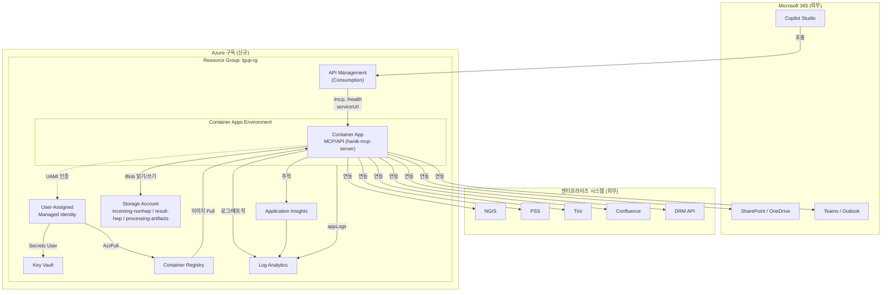
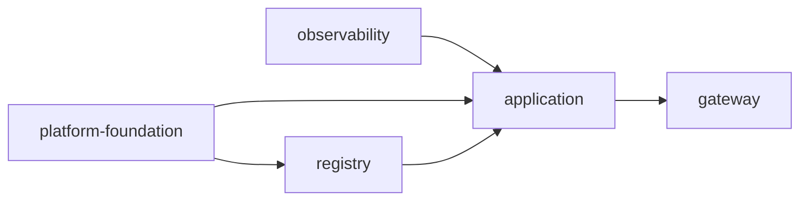

# Azure 인프라 배포 가이드 (신규 구독)

이 문서는 `lgup-m365-mcp` 스택을 **새로운 Azure 구독**에 처음부터 배포하는 방법과,
배포되는 리소스들의 **관계도**를 설명합니다.

대상 템플릿: [main.bicep](../main.bicep) (subscription 스코프) + [modules/](../modules/) + 파라미터 [main.dev.bicepparam](../main.dev.bicepparam)

---

## 1. 무엇이 만들어지는가

`main.bicep`은 **구독 스코프(`targetScope = 'subscription'`)**에서 실행되며,
리소스 그룹 1개를 만든 뒤 그 안에 아래 5개 모듈을 순서대로 배포합니다.

| 순서 | 모듈 | 생성 리소스 | 핵심 역할 |
|------|------|-------------|-----------|
| 1 | [observability.bicep](../modules/observability.bicep) | Log Analytics Workspace, Application Insights | 로그/메트릭/추적 수집 |
| 2 | [platform-foundation.bicep](../modules/platform-foundation.bicep) | User-Assigned Managed Identity, Key Vault, Storage Account(+3 컨테이너), Key Vault Secrets User 롤 | 워크로드 ID·시크릿·스토리지 기반 |
| 3 | [registry.bicep](../modules/registry.bicep) | Azure Container Registry(ACR), AcrPull 롤 | 컨테이너 이미지 저장/Pull |
| 4 | [application.bicep](../modules/application.bicep) | Container Apps Environment, Container App(MCP/API) | MCP 서버 런타임 |
| 5 | [gateway.bicep](../modules/gateway.bicep) | API Management(Consumption), API/Operation/Policy/Subscription | 외부 진입 게이트웨이(`/mcp`) |

### 생성되는 리소스 명명 규칙

`namePrefix`(기본 `lgmcp`)와 `environmentName`(기본 `dev`)을 조합합니다. 예시(`koreacentral`, `lgup-rg`):

| 리소스 | 이름 규칙 | 예시 |
|--------|-----------|------|
| Resource Group | `resourceGroupName` 파라미터 | `lgup-rg` |
| Log Analytics | `{prefix}-{env}-law` | `lgmcp-dev-law` |
| App Insights | `{prefix}-{env}-appi` | `lgmcp-dev-appi` |
| Managed Identity | `{prefix}-{env}-uami` | `lgmcp-dev-uami` |
| Container Apps Env | `{prefix}-{env}-cae` | `lgmcp-dev-cae` |
| Container App | `{prefix}-{env}-mcp-api` | `lgmcp-dev-mcp-api` |
| Key Vault | `{normalizedPrefix}{env}kv{hash}` (24자 제한) | `lgmcpdevkv3x7...` |
| Storage Account | `{normalizedPrefix}{env}st{hash}` (24자 제한) | `lgmcpdevst3x7...` |
| Container Registry | `{normalizedPrefix}{env}acr{hash}` | `lgmcpdevacr3x7...` |
| API Management | `{prefix}-{env}-apim-{hash}` | `lgmcp-dev-apim-3x7...` |

> `uniqueString(subscription().id, resourceGroupName)` 해시가 포함되므로 구독이 바뀌면 전역 고유 이름(KV/Storage/ACR/APIM)이 자동으로 달라집니다.

---

## 2. 리소스 관계도



### 의존성 흐름(배포 순서가 중요한 이유)



- `registry`는 `foundation`의 Managed Identity Principal ID가 있어야 AcrPull 롤을 만들 수 있습니다.
- `application`은 `observability`(App Insights 연결 문자열), `foundation`(ID/KV/Storage), `registry`(ACR 로그인 서버)의 출력에 의존합니다.
- `gateway`는 `application`의 Container App URL을 백엔드(`serviceUrl`)로 사용합니다.

---

## 3. 사전 준비물

| 항목 | 설명 |
|------|------|
| Azure CLI | 2.50 이상 권장 (`az version`) |
| Bicep CLI | `az bicep upgrade`로 최신화 |
| 권한 | 신규 구독에 **Owner** 또는 **Contributor + User Access Administrator** (롤 할당을 만들기 때문에 RBAC 쓰기 권한 필수) |
| 구독 | 배포 대상 신규 Azure 구독 ID |
| 시크릿 값 | `m365ClientSecret`, `ngisApiKey`, `drmApiKey` 실제 값 |

> 롤 할당(Key Vault Secrets User, AcrPull)을 만들기 때문에 단순 Contributor만으로는 실패할 수 있습니다. `User Access Administrator` 또는 `Owner` 권한이 필요합니다.

---

## 4. 신규 구독 배포 절차

### 4.1 로그인 및 구독 선택

```bash
az login
az account set --subscription "<NEW_SUBSCRIPTION_ID>"
az account show --query "{name:name, id:id, tenantId:tenantId}" -o table
```

### 4.2 필수 리소스 공급자(Resource Provider) 등록

신규 구독에서는 처음 사용하는 공급자가 미등록 상태일 수 있습니다.

```bash
for ns in \
  Microsoft.OperationalInsights \
  Microsoft.Insights \
  Microsoft.ManagedIdentity \
  Microsoft.KeyVault \
  Microsoft.Storage \
  Microsoft.ContainerRegistry \
  Microsoft.App \
  Microsoft.ApiManagement \
  Microsoft.Authorization
do
  az provider register --namespace "$ns"
done
```

등록 상태 확인:

```bash
az provider show -n Microsoft.App --query registrationState -o tsv
```

### 4.3 파라미터 파일 준비

[main.dev.bicepparam](../main.dev.bicepparam)를 복사해 환경에 맞게 수정합니다. (시크릿은 파일에 평문 저장하지 말고 4.4의 인라인 주입을 권장)

```bash
cp main.dev.bicepparam main.prod.bicepparam
```

수정 대상:

- `location`, `namePrefix`, `environmentName`, `resourceGroupName`(필요 시 `main.bicep` 기본값 override)
- `m365` 블록: 실제 테넌트 ID / SharePoint / OneDrive / Teams / Copilot Studio 값
- `integrations` 블록: 실제 NGIS / PSS / Tiro / Confluence / DRM / APIM 엔드포인트
- `containerImage`: 실제 MCP 이미지 (초기 검증은 기본 helloworld 이미지로 가능)
- `apimPublisherEmail`, `apimPublisherName`

### 4.4 What-If로 사전 검증

실제 변경 전에 무엇이 생성되는지 미리 확인합니다.

```bash
az deployment sub what-if \
  --name lgup-mcp-whatif \
  --location koreacentral \
  --template-file main.bicep \
  --parameters main.dev.bicepparam \
  --parameters \
      m365ClientSecret="$M365_CLIENT_SECRET" \
      ngisApiKey="$NGIS_API_KEY" \
      drmApiKey="$DRM_API_KEY"
```

> 시크릿은 셸 환경변수로 주입하세요. 예: `export M365_CLIENT_SECRET='...'` (히스토리에 남지 않도록 주의)

### 4.5 배포 실행

```bash
az deployment sub create \
  --name lgup-mcp-deploy \
  --location koreacentral \
  --template-file main.bicep \
  --parameters main.dev.bicepparam \
  --parameters \
      m365ClientSecret="$M365_CLIENT_SECRET" \
      ngisApiKey="$NGIS_API_KEY" \
      drmApiKey="$DRM_API_KEY"
```

> `--location`은 배포 메타데이터가 저장될 리전이며, 실제 리소스 리전은 파라미터의 `location`을 따릅니다.

### 4.6 출력 값 확인

```bash
az deployment sub show \
  --name lgup-mcp-deploy \
  --query properties.outputs \
  -o json
```

주요 출력: `containerAppUrl`, `apimGatewayUrl`, `apimMcpEndpoint`, `keyVaultName`, `storageAccountName`, `containerRegistryLoginServer`.

---

## 5. 애플리케이션 이미지 배포 (선택)

초기엔 기본 helloworld 이미지로 인프라를 검증하고, 이후 실제 MCP 서버([app/](../app/))로 교체합니다.

```bash
# 1) 배포된 ACR 이름 확인
ACR_NAME=$(az deployment sub show -n lgup-mcp-deploy --query "properties.outputs.containerRegistryName.value" -o tsv)

# 2) ACR 빌드(클라우드 빌드)
az acr build --registry "$ACR_NAME" --image hanik-mcp-server:1.0.0 ./app

# 3) containerImage 파라미터를 새 이미지로 바꿔 재배포
az deployment sub create \
  --name lgup-mcp-deploy \
  --location koreacentral \
  --template-file main.bicep \
  --parameters main.dev.bicepparam \
  --parameters containerImage="${ACR_NAME}.azurecr.io/hanik-mcp-server:1.0.0" \
  --parameters \
      m365ClientSecret="$M365_CLIENT_SECRET" \
      ngisApiKey="$NGIS_API_KEY" \
      drmApiKey="$DRM_API_KEY"
```

> Container App은 UAMI의 `AcrPull` 권한으로 이미지를 가져오므로 admin 사용자/패스워드가 필요 없습니다.

---

## 6. 배포 검증

```bash
# Container App 직접 헬스 체크
APP_URL=$(az deployment sub show -n lgup-mcp-deploy --query "properties.outputs.containerAppUrl.value" -o tsv)
curl -s "$APP_URL/health"

# APIM 게이트웨이를 통한 MCP 엔드포인트 (구독 키 필요)
APIM_NAME=$(az deployment sub show -n lgup-mcp-deploy --query "properties.outputs.apimGatewayUrl.value" -o tsv)
```

APIM은 `subscriptionRequired: true`이므로 `/mcp` 호출 시 `Ocp-Apim-Subscription-Key` 헤더가 필요합니다. 구독 키는 포털 또는 CLI로 조회합니다.

```bash
az apim subscription show ... # 또는 포털 > API Management > Subscriptions > mcp-subscription > Keys
```

---

## 7. 보안 주의사항 (신규 구독 기준)

현재 스캐폴드는 **빠른 검증용** 설정입니다. 운영 전환 시 다음을 강화하세요.

- **Key Vault / Storage `publicNetworkAccess`**: 현재 공개. Private Endpoint + VNet으로 제한.
- **Container App ingress `external: true`**: 현재 공개. APIM/Front Door 뒤로만 노출하도록 제한.
- **시크릿 관리**: 파라미터 평문 대신 Key Vault 참조 또는 배포 시 주입 사용. `main.dev.bicepparam`의 `replace-me`를 절대 그대로 배포하지 마세요.
- **RBAC**: 운영자/워크로드 페르소나별 최소 권한 롤 분리.
- **APIM Consumption 티어**: VNet 통합 미지원. 네트워크 격리가 필요하면 Developer/Premium 티어 검토.

---

## 8. 리소스 정리 (롤백/삭제)

```bash
# 리소스 그룹 삭제 (그룹 내 모든 리소스 제거)
az group delete --name lgup-rg --yes --no-wait
```

> Key Vault는 **소프트 삭제(보존 90일)**가 켜져 있어 같은 이름으로 재배포 시 충돌할 수 있습니다. 필요 시 purge:
> ```bash
> az keyvault purge --name <keyVaultName> --location koreacentral
> ```

---

## 9. 빠른 참조 (체크리스트)

- [ ] `az login` 및 신규 구독 선택
- [ ] 리소스 공급자 등록 완료
- [ ] RBAC 권한(Owner / UAA) 확인
- [ ] 파라미터 파일의 M365 / integrations 실제 값으로 교체
- [ ] 시크릿을 환경변수로 준비 (`replace-me` 제거)
- [ ] `what-if`로 사전 검증
- [ ] `az deployment sub create`로 배포
- [ ] `/health` 및 APIM `/mcp` 검증
- [ ] 실제 이미지로 `containerImage` 교체 재배포
- [ ] 운영 전 보안 강화 항목 반영
