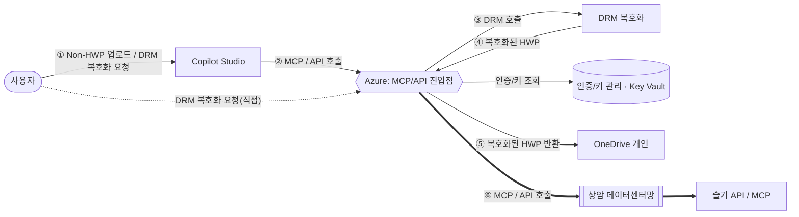
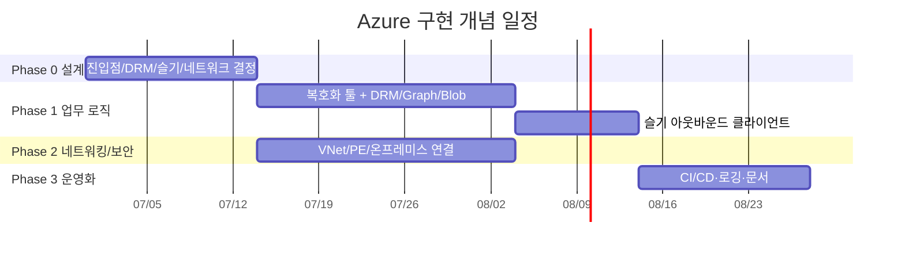

# Azure 구현 로드맵 — DRM 복호화 · 슬기 연동 (lgup-m365-mcp)

> 아키텍처 다이어그램의 **Azure 영역**(MCP/API 진입점 · DRM 호출 · 인증/키 관리 · 상암 데이터센터망/슬기 API 연동)을 실제로 구현하기 위한 단계별 로드맵.
> 기준 다이어그램: M365 ↔ Azure ↔ 상암 DC · 기준 코드: `main.bicep`, `app/src/index.ts` · 작성일 2026-06-28

상태 범례: ✅ 완료 · 🟡 부분(배선만) · 🔴 없음

---

## 0. 요약

인프라 뼈대(Container Apps · ACR · Key Vault · Storage · APIM · 관측성 · Easy Auth)는 **약 70% 완성**. 다이어그램이 요구하는 **실제 업무 기능**(DRM 복호화 파이프라인, OneDrive 파일 왕복, 상암 DC 슬기 API 연동, 온프레미스 네트워킹)은 **거의 미구현(0%)**.

| 책임 영역(다이어그램) | 상태 | 핵심 부족분 |
|---|---|---|
| MCP/API 진입점 | 🟡 | 복호화 요청 툴/엔드포인트 없음, MCP vs REST 미결 |
| DRM 호출(복호화) | 🔴 | DRM 클라이언트 코드·스펙 없음 |
| 인증/키 관리 | 🟡 | Key Vault 런타임 조회·OBO 흐름 없음 |
| OneDrive 파일 반환 | 🔴 | Microsoft Graph 연동 없음 |
| 상암 DC / 슬기 API | 🔴 | 온프레미스 연결·클라이언트 전무 |

---

## 1. 목표 아키텍처 (Azure 흐름)

> **물음표(MCP/API?) 해소가 선행**. 진입점을 MCP 툴/REST/둘 다 중 무엇으로 노출하느냐에 따라 앱 구조·APIM 정책·Copilot Studio 커넥터 구성이 갈린다.

---

## 2. 현재 자산 인벤토리

| 영역 | 파일/리소스 | 상태 | 비고 |
|---|---|---|---|
| 오케스트레이션 | `main.bicep` | ✅ | RG·모듈 배선 완비 |
| 관측성 | `modules/observability.bicep` | ✅ | Log Analytics + App Insights |
| 플랫폼 기반 | `modules/platform-foundation.bicep` | ✅ | UAMI · Key Vault · Storage(3 컨테이너) |
| 레지스트리 | `modules/registry.bicep` | ✅ | ACR + AcrPull RBAC |
| 애플리케이션 | `modules/application.bicep` | ✅ | Container Apps + Easy Auth + 시크릿 주입 |
| 게이트웨이 | `modules/gateway.bicep` | 🟡 | APIM Consumption(공인망). 사내망 도달 불가 |
| MCP 서버 앱 | `app/src/index.ts` | 🔴(골격) | 툴 2개(`test_hanik`, `get_current_user`)뿐 |
| 스토리지 컨테이너 | `incoming-nonhwp` · `processing-artifacts` · `result-hwp` | ✅ | 버킷만 준비(로직 없음) |
| DRM 배선 | `DRM_API_BASE_URL` · `drm-api-key` | 🟡 | env/시크릿만 주입, 호출 코드 없음 |
| 네트워킹 | — | 🔴 | VNet/PE/온프레미스 연결 전무 |
| 문서 | `docs/*-deployment-guide.*` | 🟡 | 인프라 배포 중심, DRM/슬기 흐름 미반영 |

---

## 3. Gap 분석 (다이어그램 요소별)

### A. MCP/API 진입점
- 복호화 요청 툴/엔드포인트(`decrypt_file` 등) 부재.
- 노출 방식(MCP/REST/둘 다) 미결 — 설계 분기점.
- 요청 멱등성·작업 ID(비동기 시) 설계 없음.

### B. DRM 호출 (복호화 핵심)
- DRM API 스펙(인증·요청/응답·동기성·파일전달) 미정의.
- 복호화 파이프라인 단계(수신 → DRM 호출 → 결과 생성 → 반환) 미구현.
- 대용량/타임아웃/재시도/실패 정책 없음.

### C. 인증/키 관리
- 자격증명이 env 시크릿 주입에 의존 — **Key Vault 런타임 조회 코드 없음**.
- Copilot Studio → Azure 사용자 토큰 전달/OBO 흐름 미설계.
- 운영자/워크로드 RBAC 분리, 키 로테이션 없음.

### D. 상암 데이터센터망 / 슬기 API ⚠️ 최대 리스크
- 온프레미스 연결 수단 없음 → **VNet + ExpressRoute/S2S VPN + Private DNS** 필요.
- 현 APIM Consumption / 공개 Container Apps 구성은 사내망 도달 불가.
- 슬기 API/MCP 클라이언트·엔드포인트·인증, 송신 IP 고정(NAT) 미정의.

---

## 4. Phase 0 · 설계 확정 (선행 필수)

| # | 항목 | 산출물 | 의존 |
|---|---|---|---|
| 0-1 | 진입점 방식 결정 (MCP vs REST vs 둘 다) | 인터페이스 결정서 | — |
| 0-2 | DRM API 인터페이스 스펙 확보 | DRM 연동 규격서 | DRM 팀 |
| 0-3 | 슬기 API/MCP 인터페이스 스펙 확보 | 슬기 연동 규격서 | 슬기/상암 팀 |
| 0-4 | 데이터 흐름·권한 모델 확정 | 데이터 플로우 다이어그램 | 0-1~0-3 |
| 0-5 | 온프레미스 연결 방식 결정(ExpressRoute vs VPN) | 네트워크 설계 결정서 | 네트워크 팀 |

> ⚠️ 0-1·0-2·0-5(물음표 3개)가 전체 일정의 **임계 경로**. 미정인 채 Phase 1·2 코드 확정 불가.

---

## 5. Phase 1 · 업무 로직 (애플리케이션)

| # | 항목 | 대상 | 의존 |
|---|---|---|---|
| 1-1 | `decrypt_file` 복호화 MCP 툴/REST 엔드포인트 추가 | `app/src/index.ts` | 0-1 |
| 1-2 | DRM 호출 클라이언트 구현(Key Vault 키 조회) | app | 0-2, 1-5 |
| 1-3 | Microsoft Graph 연동: OneDrive 다운로드/업로드 | app | 0-4 |
| 1-4 | Blob 스테이징 파이프라인(`incoming → processing → result`) | app | 0-4 |
| 1-5 | Key Vault 런타임 시크릿 조회(SDK/관리 ID) | app | — |
| 1-6 | 슬기 API/MCP 아웃바운드 클라이언트 | app | 0-3, 2-2 |
| 1-7 | 비동기 작업 처리(작업 ID·상태 조회) | app | 0-2 |

> 현재 앱은 stateless Streamable HTTP MCP 구조. 위 항목은 툴/라우트 확장으로 추가하고, 외부 자격증명은 1-5의 Key Vault 조회로 통일.

---

## 6. Phase 2 · 네트워킹 / 보안 (인프라)

| # | 항목 | 대상 | 의존 |
|---|---|---|---|
| 2-1 | `modules/networking.bicep`: VNet + 서브넷 + Container Apps VNet 통합 | 신규 모듈 | 0-5 |
| 2-2 | ExpressRoute/S2S VPN + Private DNS로 상암 DC 연결 | 인프라 | 0-5, 2-1 |
| 2-3 | Storage/Key Vault Private Endpoint 적용 | foundation 모듈 | 2-1 |
| 2-4 | NAT Gateway 송신 IP 고정(사내 방화벽 allow-list) | networking | 2-1 |
| 2-5 | Key Vault 시크릿 시딩 자동화 + RBAC 분리 | 인프라 | — |
| 2-6 | APIM 티어 재검토(Consumption → Standard v2/Premium, VNet 통합) | `gateway.bicep` | 0-5 |

> ⚠️ 상암 DC 연결이 최대 난관. 2-1·2-2·2-6은 함께 묶어 설계.

---

## 7. Phase 3 · 운영화

| # | 항목 | 대상 |
|---|---|---|
| 3-1 | 복호화 실패/재시도/감사 로깅, 민감정보 마스킹 | app + App Insights |
| 3-2 | GitHub Actions CI/CD(이미지 빌드 → ACR → 배포) | `.github/workflows` |
| 3-3 | 환경 승인·what-if·정책 게이트(SDLC 정렬) | CI/CD |
| 3-4 | 알림(`modules/alerts.bicep`) · 헬스 대시보드 | 신규 모듈 |
| 3-5 | 문서 갱신: 본 로드맵 + 배포 가이드에 DRM/슬기/상암 흐름 반영 | `docs/` |

---

## 8. 결정 필요 사항 (Open Questions)

| ID | 질문 | 영향 | 담당 |
|---|---|---|---|
| Q1 | 진입점을 MCP 툴 / REST / 둘 다 중 무엇으로? | 앱·APIM·커넥터 구조 | 아키텍트 |
| Q2 | DRM API 스펙(인증·포맷·동기성·파일전달)? | Phase 1 전체 | DRM 팀 |
| Q3 | 상암 DC 연결을 ExpressRoute / S2S VPN 중 무엇으로? | Phase 2 전체·비용 | 네트워크 팀 |
| Q4 | 복호화 결과 반환 경로: OneDrive 직접 / Blob 링크? | Graph 권한 모델 | 아키텍트 |
| Q5 | 슬기 API 연동 트리거 시점(복호화 전/후/병렬)? | 파이프라인 순서 | 업무 담당 |
| Q6 | 대용량·장시간 작업 시 동기 vs 비동기? | 1-1·1-7 설계 | 아키텍트 |

---

## 9. 리스크

| 리스크 | 영향 | 완화책 |
|---|---|---|
| 상암 DC 연결 리드타임 | 높음 | Phase 0에서 네트워크 팀 조기 착수, 회선/방화벽 선행 신청 |
| DRM/슬기 스펙 미확보 | 높음 | 목 인터페이스로 Phase 1 병행, 계약서 우선 확정 |
| 민감정보(복호화 파일) 유출 | 높음 | Private Endpoint·암호화·짧은 보존주기·감사 로깅 |
| APIM Consumption 한계 | 중간 | VNet 통합 가능 티어로 조기 전환 |
| OneDrive Graph 권한 과다 | 중간 | 최소 권한 스코프·폴더 한정 위임 |

---

## 10. 마일스톤 (개념 일정)

> **권장 시작점**: Q1·Q2·Q3 확정과 동시에, 의존 없는 `1-5(Key Vault 조회)`·`2-1(VNet 모듈)`을 병렬 착수하면 임계 경로 단축.
