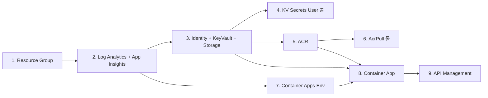

# Bicep 미사용 시 수동 배포 가이드 (Azure CLI / 포털)

이 문서는 **Bicep(IaC)을 사용할 수 없는 환경**에서 `lgup-m365-mcp` 인프라를
**Azure CLI 명령형(imperative) 명령** 또는 **Azure 포털**로 동일하게 구축하는 방법을 설명합니다.

> 기준 아키텍처는 [main.bicep](../main.bicep)와 동일합니다. 리소스 종류·역할·관계는
> [azure-deployment-guide.md](azure-deployment-guide.md)의 "리소스 관계도"를 참조하세요.

---

## 0. 왜 이 문서가 필요한가

다음과 같은 상황에서 사용합니다.

- 조직 정책상 Bicep/ARM 템플릿 배포가 차단된 경우
- 빠른 PoC를 위해 포털에서 클릭으로 만들고 싶은 경우
- 기존 리소스에 일부만 추가/수정해야 해서 전체 템플릿 배포가 부담스러운 경우
- 학습 목적으로 각 리소스를 단계별로 이해하고 싶은 경우

> 운영 환경에서는 재현성·드리프트 관리 측면에서 **Bicep 배포를 권장**합니다. 이 문서는 대체/보조 수단입니다.

---

## 1. 변수 준비

모든 명령에서 재사용할 변수를 셸에 정의합니다. (Bicep 명명 규칙과 동일한 결과를 내도록 구성)

```bash
# --- 기본 설정 ---
PREFIX="lgmcp"
ENV="dev"
LOCATION="koreacentral"
RG="lgup-rg"
SUBSCRIPTION_ID="<NEW_SUBSCRIPTION_ID>"

az login
az account set --subscription "$SUBSCRIPTION_ID"

# --- 전역 고유 이름용 해시 (Bicep의 uniqueString 대체) ---
HASH=$(echo -n "${SUBSCRIPTION_ID}${RG}" | shasum | cut -c1-8)

# --- 리소스 이름 ---
LAW="${PREFIX}-${ENV}-law"
APPI="${PREFIX}-${ENV}-appi"
UAMI="${PREFIX}-${ENV}-uami"
CAE="${PREFIX}-${ENV}-cae"
APP="${PREFIX}-${ENV}-mcp-api"
KV="${PREFIX}${ENV}kv${HASH}"          # 24자 이내 확인
ST="${PREFIX}${ENV}st${HASH}"          # 24자 이내, 소문자/숫자만
ACR="${PREFIX}${ENV}acr${HASH}"
APIM="${PREFIX}-${ENV}-apim-${HASH}"

# --- 시크릿 (환경변수로 주입, 히스토리 주의) ---
export M365_CLIENT_SECRET='...'
export NGIS_API_KEY='...'
export DRM_API_KEY='...'
```

> `shasum` 결과는 Bicep의 `uniqueString`과 값이 다릅니다. 이름의 전역 고유성만 확보하면 되므로 문제없습니다.
> 단, Key Vault/Storage 이름은 **24자 이내, 소문자+숫자**여야 합니다.

---

## 2. 리소스 공급자 등록

```bash
for ns in \
  Microsoft.OperationalInsights Microsoft.Insights Microsoft.ManagedIdentity \
  Microsoft.KeyVault Microsoft.Storage Microsoft.ContainerRegistry \
  Microsoft.App Microsoft.ApiManagement Microsoft.Authorization
do
  az provider register --namespace "$ns"
done
```

---

## 3. 리소스 그룹

```bash
az group create --name "$RG" --location "$LOCATION" \
  --tags workload=m365-mcp environment="$ENV"
```

**포털**: 홈 > 리소스 그룹 > 만들기 > 이름/지역 입력.

---

## 4. 관측성 (observability)

### 4.1 Log Analytics Workspace

```bash
az monitor log-analytics workspace create \
  --resource-group "$RG" \
  --workspace-name "$LAW" \
  --location "$LOCATION" \
  --retention-time 30 \
  --sku PerGB2018
```

### 4.2 Application Insights (워크스페이스 기반)

```bash
az extension add --name application-insights --upgrade

LAW_ID=$(az monitor log-analytics workspace show \
  --resource-group "$RG" --workspace-name "$LAW" --query id -o tsv)

az monitor app-insights component create \
  --app "$APPI" \
  --resource-group "$RG" \
  --location "$LOCATION" \
  --kind web \
  --application-type web \
  --workspace "$LAW_ID"

APPI_CONN=$(az monitor app-insights component show \
  --app "$APPI" --resource-group "$RG" \
  --query connectionString -o tsv)
```

---

## 5. 플랫폼 기반 (platform-foundation)

### 5.1 User-Assigned Managed Identity

```bash
az identity create --name "$UAMI" --resource-group "$RG" --location "$LOCATION"

UAMI_ID=$(az identity show -n "$UAMI" -g "$RG" --query id -o tsv)
UAMI_CLIENTID=$(az identity show -n "$UAMI" -g "$RG" --query clientId -o tsv)
UAMI_PRINCIPALID=$(az identity show -n "$UAMI" -g "$RG" --query principalId -o tsv)
```

### 5.2 Key Vault (RBAC 인증, 소프트 삭제)

```bash
az keyvault create \
  --name "$KV" \
  --resource-group "$RG" \
  --location "$LOCATION" \
  --enable-rbac-authorization true \
  --enable-soft-delete true \
  --retention-days 90 \
  --public-network-access Enabled

KV_URI=$(az keyvault show -n "$KV" -g "$RG" --query properties.vaultUri -o tsv)
KV_ID=$(az keyvault show -n "$KV" -g "$RG" --query id -o tsv)
```

### 5.3 Storage Account + 컨테이너 3개

```bash
az storage account create \
  --name "$ST" \
  --resource-group "$RG" \
  --location "$LOCATION" \
  --sku Standard_LRS \
  --kind StorageV2 \
  --access-tier Hot \
  --min-tls-version TLS1_2 \
  --allow-blob-public-access false \
  --https-only true

for c in incoming-nonhwp result-hwp processing-artifacts; do
  az storage container create \
    --name "$c" \
    --account-name "$ST" \
    --auth-mode login \
    --public-access off
done
```

### 5.4 롤 할당: Key Vault Secrets User → UAMI

```bash
az role assignment create \
  --assignee-object-id "$UAMI_PRINCIPALID" \
  --assignee-principal-type ServicePrincipal \
  --role "Key Vault Secrets User" \
  --scope "$KV_ID"
```

---

## 6. 컨테이너 레지스트리 (registry)

```bash
az acr create \
  --name "$ACR" \
  --resource-group "$RG" \
  --location "$LOCATION" \
  --sku Basic \
  --admin-enabled false

ACR_ID=$(az acr show -n "$ACR" --query id -o tsv)
ACR_LOGINSERVER=$(az acr show -n "$ACR" --query loginServer -o tsv)
```

### 6.1 롤 할당: AcrPull → UAMI

```bash
az role assignment create \
  --assignee-object-id "$UAMI_PRINCIPALID" \
  --assignee-principal-type ServicePrincipal \
  --role "AcrPull" \
  --scope "$ACR_ID"
```

### 6.2 (선택) 애플리케이션 이미지 빌드/푸시

```bash
az acr build --registry "$ACR" --image hanik-mcp-server:1.0.0 ./app
CONTAINER_IMAGE="${ACR_LOGINSERVER}/hanik-mcp-server:1.0.0"
# 초기 검증용 기본 이미지로 시작하려면:
# CONTAINER_IMAGE="mcr.microsoft.com/azuredocs/containerapps-helloworld:latest"
```

---

## 7. Container Apps (application)

```bash
az extension add --name containerapp --upgrade
az provider register --namespace Microsoft.App
az provider register --namespace Microsoft.OperationalInsights
```

### 7.1 Container Apps Environment

```bash
LAW_CUSTOMERID=$(az monitor log-analytics workspace show \
  -g "$RG" -n "$LAW" --query customerId -o tsv)
LAW_KEY=$(az monitor log-analytics workspace get-shared-keys \
  -g "$RG" -n "$LAW" --query primarySharedKey -o tsv)

az containerapp env create \
  --name "$CAE" \
  --resource-group "$RG" \
  --location "$LOCATION" \
  --logs-destination log-analytics \
  --logs-workspace-id "$LAW_CUSTOMERID" \
  --logs-workspace-key "$LAW_KEY"
```

### 7.2 Container App 생성

먼저 시크릿과 환경변수 없이 기본 생성한 뒤, 시크릿/환경변수를 설정합니다.

```bash
az containerapp create \
  --name "$APP" \
  --resource-group "$RG" \
  --environment "$CAE" \
  --image "$CONTAINER_IMAGE" \
  --user-assigned "$UAMI_ID" \
  --registry-server "$ACR_LOGINSERVER" \
  --registry-identity "$UAMI_ID" \
  --target-port 8080 \
  --ingress external \
  --min-replicas 1 \
  --max-replicas 2 \
  --cpu 1 --memory 2Gi
```

> 공개(public) 이미지로 검증할 때는 `--registry-*` 옵션을 생략하세요.

### 7.3 시크릿 등록

```bash
az containerapp secret set \
  --name "$APP" --resource-group "$RG" \
  --secrets \
    m365-client-secret="$M365_CLIENT_SECRET" \
    ngis-api-key="$NGIS_API_KEY" \
    drm-api-key="$DRM_API_KEY"
```

### 7.4 환경변수 설정 (Bicep의 env 블록과 동일)

```bash
az containerapp update \
  --name "$APP" --resource-group "$RG" \
  --set-env-vars \
    APPLICATIONINSIGHTS_CONNECTION_STRING="$APPI_CONN" \
    AZURE_CLIENT_ID="$UAMI_CLIENTID" \
    M365_TENANT_ID="<tenantId>" \
    M365_SHAREPOINT_SITE_URL="<sharePointSiteUrl>" \
    M365_ONEDRIVE_ROOT_PATH="<oneDriveRootPath>" \
    M365_TEAMS_TENANT_DOMAIN="<teamsTenantDomain>" \
    M365_COPILOT_STUDIO_ENVIRONMENT="<copilotStudioEnvironment>" \
    APIM_GATEWAY_URL="<apimGatewayUrl>" \
    NGIS_BASE_URL="<ngisBaseUrl>" \
    PSS_BASE_URL="<pssBaseUrl>" \
    TIRO_BASE_URL="<tiroBaseUrl>" \
    CONFLUENCE_BASE_URL="<confluenceBaseUrl>" \
    DRM_API_BASE_URL="<drmApiBaseUrl>" \
    KEY_VAULT_URI="$KV_URI" \
    STORAGE_ACCOUNT_NAME="$ST" \
    M365_CLIENT_SECRET=secretref:m365-client-secret \
    NGIS_API_KEY=secretref:ngis-api-key \
    DRM_API_KEY=secretref:drm-api-key

APP_FQDN=$(az containerapp show -n "$APP" -g "$RG" \
  --query properties.configuration.ingress.fqdn -o tsv)
APP_URL="https://${APP_FQDN}"
echo "$APP_URL"
```

---

## 8. API Management (gateway)

> Consumption 티어는 프로비저닝이 빠릅니다(수 분). Developer/Premium은 수십 분 이상 소요됩니다.

### 8.1 APIM 인스턴스 (Consumption, 시스템 할당 ID)

```bash
az apim create \
  --name "$APIM" \
  --resource-group "$RG" \
  --location "$LOCATION" \
  --sku-name Consumption \
  --publisher-email "admin@example.com" \
  --publisher-name "LGUP MCP" \
  --enable-managed-identity true

GATEWAY_URL=$(az apim show -n "$APIM" -g "$RG" \
  --query gatewayUrl -o tsv)
```

### 8.2 API 생성 (백엔드 = Container App)

```bash
az apim api create \
  --resource-group "$RG" \
  --service-name "$APIM" \
  --api-id mcp \
  --display-name "Hanik MCP" \
  --path "" \
  --protocols https \
  --service-url "$APP_URL" \
  --subscription-required true
```

### 8.3 Operation 추가 (`POST /mcp`, `GET /health`)

```bash
az apim api operation create \
  --resource-group "$RG" --service-name "$APIM" --api-id mcp \
  --operation-id post-mcp --display-name "MCP POST" \
  --method POST --url-template "/mcp"

az apim api operation create \
  --resource-group "$RG" --service-name "$APIM" --api-id mcp \
  --operation-id get-health --display-name "Health" \
  --method GET --url-template "/health"
```

### 8.4 정책: 응답 버퍼링 비활성화 (MCP Streamable HTTP/SSE)

CLI로 API 정책을 직접 설정하기 번거로우면 **포털 > API Management > APIs > Hanik MCP > All operations > Policies**에서 아래 XML을 붙여넣습니다.

```xml
<policies>
  <inbound><base /></inbound>
  <backend><forward-request buffer-response="false" /></backend>
  <outbound><base /></outbound>
  <on-error><base /></on-error>
</policies>
```

> REST/CLI로 설정하려면 `az rest`로 `Microsoft.ApiManagement/service/apis/policies` 리소스를 PUT 하면 됩니다.

### 8.5 구독(Subscription) 생성 및 키 조회

```bash
# 포털: API Management > Subscriptions > 추가 (scope = mcp API)
# 키 조회:
az apim subscription list \
  --resource-group "$RG" --service-name "$APIM" \
  --query "[].{name:name, displayName:displayName}" -o table
```

---

## 9. 배포 검증

```bash
# Container App 직접 헬스 체크
curl -s "$APP_URL/health"

# APIM 경유 (구독 키 헤더 필요)
curl -s -X POST "${GATEWAY_URL}/mcp" \
  -H "Ocp-Apim-Subscription-Key: <SUBSCRIPTION_KEY>" \
  -H "Content-Type: application/json" \
  -d '{"jsonrpc":"2.0","id":1,"method":"tools/list"}'
```

---

## 10. 리소스 생성 순서 요약

Bicep의 모듈 의존성과 동일한 순서를 따라야 합니다.



| 단계 | 반드시 먼저 있어야 하는 것 |
|------|---------------------------|
| App Insights | Log Analytics |
| KV Secrets User 롤 | Key Vault + UAMI |
| AcrPull 롤 | ACR + UAMI |
| Container Apps Env | Log Analytics |
| Container App | UAMI, ACR, Env, (App Insights 연결 문자열) |
| API Management API | Container App URL |

---

## 11. 정리 (삭제)

```bash
az group delete --name "$RG" --yes --no-wait

# Key Vault 소프트 삭제(90일) 때문에 같은 이름 재생성이 막히면:
az keyvault purge --name "$KV" --location "$LOCATION"
```

---

## 12. 주의사항

- **롤 할당 권한**: `az role assignment create`는 **User Access Administrator/Owner** 권한이 필요합니다.
- **롤 전파 지연**: 롤 할당 후 권한이 적용되기까지 수십 초~수 분 걸릴 수 있습니다. Container App 이미지 Pull이 실패하면 잠시 후 재시도하세요.
- **시크릿 평문 노출**: 셸 히스토리/로그에 시크릿이 남지 않도록 주의하세요.
- **이름 길이/문자 제약**: Key Vault·Storage는 24자 이내, Storage는 소문자+숫자만 허용됩니다.
- **재현성**: 수동 생성은 드리프트 관리가 어렵습니다. 가능해지면 [main.bicep](../main.bicep)로 IaC 전환을 권장합니다.
